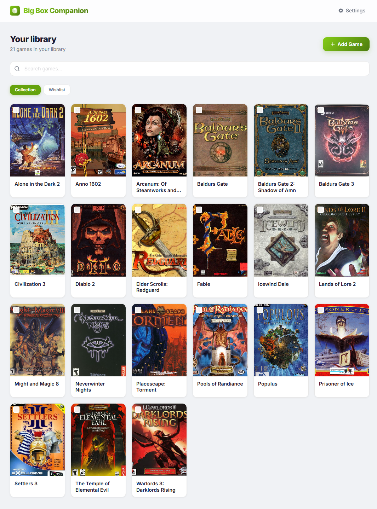

# Boxy



[](LICENSE)
[](https://hub.docker.com/r/larsmikki/boxy)
[](https://github.com/larsmikki/boxy/pkgs/container/boxy)
[](https://nodejs.org/)

**Boxy** is a self-hosted game collection manager. Track your physical game library and wishlist, attach box art, filter by condition, and back up everything to a single JSON file — no cloud accounts, no subscriptions, no tracking.

## Features

- Add, edit, and delete games with title, condition, box art, and notes
- Separate **Collection** and **Wishlist** tabs
- **Box art search** powered by DuckDuckGo image search (no API key required)
- Upload box art from a file or paste an image URL
- **Bulk operations** — update condition or move multiple games at once
- Export and import backups as self-contained JSON (images embedded as base64)
- 10 built-in themes (light and dark) with live preview
- Adjustable card sizes (small / medium / large)
- Fully offline after first load — your data never leaves your machine

## Getting started

Pick whichever install path matches your setup. All paths land on [http://localhost:3070](http://localhost:3070). No database to set up, no external services required.

### 1. Docker (Docker Desktop, NAS, or any Docker server)

Works on Synology, Unraid, TrueNAS, QNAP, Proxmox, or a plain Docker host.

```bash
docker run -d \
  --name boxy \
  -p 3070:3070 \
  -v boxy-data:/app/data \
  --restart unless-stopped \
  larsmikki/boxy:latest
```

Or with Compose:

```yaml
services:
  boxy:
    image: larsmikki/boxy:latest
    container_name: boxy
    ports:
      - "3070:3070"
    volumes:
      - boxy-data:/app/data
    restart: unless-stopped

volumes:
  boxy-data:
```

### 2. Local install on Windows

Requires [Git for Windows](https://git-scm.com/download/win) and [Node.js 20+](https://nodejs.org/).

```powershell
git clone https://github.com/larsmikki/boxy.git
cd boxy
npm install
npm run dev
```

For a production build: `npm run build && npm start`.

### 3. Local install on macOS

```bash
brew install node git
git clone https://github.com/larsmikki/boxy.git
cd boxy
npm install
npm run dev
```

For a production build: `npm run build && npm start`.

### 4. Local install on Linux

Debian/Ubuntu:

```bash
curl -fsSL https://deb.nodesource.com/setup_20.x | sudo -E bash -
sudo apt-get install -y nodejs git

git clone https://github.com/larsmikki/boxy.git
cd boxy
npm install
npm run dev
```

On Fedora/RHEL use `dnf install nodejs git`; on Arch use `pacman -S nodejs npm git`.

For a production build: `npm run build && npm start`.

## Configuration

All configuration is done via environment variables:

| Variable   | Default     | Description                           |
|------------|-------------|---------------------------------------|
| `PORT`     | `3070`      | Port the server listens on            |
| `DATA_DIR` | `/app/data` | Directory for `games.json` and images |

## Usage

| Action | How |
|--------|-----|
| Add a game | Click **Add Game** on the main page |
| Find box art | Type the game title, then click **Find Box Art** |
| Edit a game | Click the pencil icon on any card |
| Move to/from wishlist | Use the bookmark icon or the **Wishlist** tab |
| Bulk select | Check the checkbox on cards, then use the toolbar |
| Export backup | **Settings → Export Backup** |
| Import backup | **Settings → Import Backup** |
| Change theme | **Settings → Themes** |

## Data and runtime folders

All data is stored in `DATA_DIR` (the Docker volume `boxy-data` by default):

```
/app/data/
  games.json       # your game collection
  images/          # uploaded and proxied box art
```

To back up manually, copy `games.json` and the `images/` folder. The **Export Backup** feature in Settings produces a single portable JSON file with images embedded.

## Troubleshooting

**Box art search returns no results**
DuckDuckGo rate-limits scraped requests. Wait a moment and try again, or paste an image URL directly.

**Port already in use**
Change the host port in your `docker-compose.yml` (e.g. `"3080:3070"`) and restart.

**Container can't write to the data directory**
Make sure the Docker volume is mounted and the container has write permissions. Using a named volume (as above) is recommended over bind-mounting a host directory.

**Lost my data after recreating the container**
Data is stored in the Docker volume, not inside the container. Use `docker volume ls` to verify the volume exists and mount it again when recreating.

## Contributing

Issues and pull requests are welcome. Please open an issue first to discuss larger changes.

## License

[MIT](LICENSE)

## Support

If Boxy saves you time, consider [buying me a coffee](https://buymeacoffee.com/larsmikki) or [donating via PayPal](https://paypal.me/larsmikki). It helps keep the project free and maintained.
